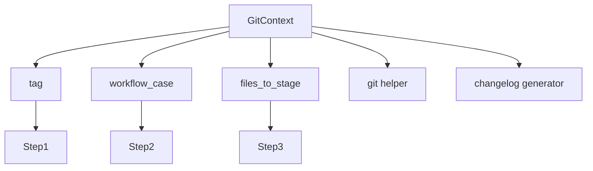
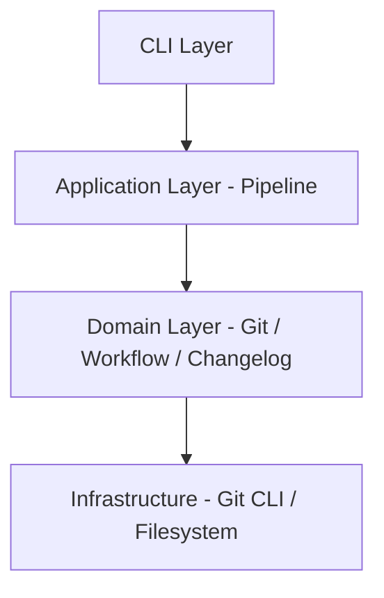

<!-- docs/guides/GitWorkflowEngine/custy_pipeline_system/ALL.md -->

Perfect move. Locking in documentation **before expanding further** is exactly what keeps this system maintainable.

I’ll give you **two complete `.md` files**:

---

# 📄 1. `docs/developer_guide.md`

````markdown
# 🧑‍💻 Developer Guide — Custy Pipeline System

## 📌 Overview

Custy uses a **pipeline-based architecture** to orchestrate Git operations such as:

- validation
- commit message editing
- changelog generation
- commit & tagging
- backup & cleanup
- workflow transitions

Instead of a monolithic flow, the system is broken into **small, reusable steps** executed sequentially.

---

## 🧱 Core Concepts

### 1. Pipeline

The pipeline is the **orchestrator** that runs steps in order.

```python
pipeline.run(context)
````

Each step performs a single responsibility.

---

### 2. Step

A step is a unit of execution.

```python
class CommitStep(BaseStep):
    def execute(self, ctx):
        ...
```

Rules:

* Must implement `execute(context)`
* Should only do **one thing**
* Should not depend on other steps directly

---

### 3. Context

The context is a shared object passed across all steps.

```python
ctx.tag
ctx.files_to_stage
ctx.git
```

Purpose:

* Share state between steps
* Avoid tight coupling

---

### 4. Step Registry

Steps are registered globally and referenced by name.

```python
StepRegistry.register("commit", CommitStep)
```

This enables:

* dynamic pipelines
* plugin system
* decoupling

---

### 5. Pipeline Builder

Builds pipeline from configuration.

```python
builder.build([
    {"name": "validate"},
    {"name": "commit"},
])
```

---

## 🔁 Execution Flow

```text
GitCommitTagger
    ↓
PipelineBuilder
    ↓
Pipeline
    ↓
Steps (execute one by one)
    ↓
Domain Logic (Git / Changelog / Workflow)
```

---

## 🧩 Available Steps

| Step          | Responsibility                       |
| ------------- | ------------------------------------ |
| validate      | Validate repo, files, tag            |
| workflow_init | Validate transition & prepare branch |
| edit_commit   | Generate + edit commit message       |
| changelog     | Generate CHANGELOG.md                |
| commit        | Stage + commit                       |
| tag           | Create git tag                       |
| backup        | Backup messages                      |
| push          | Push to remote                       |
| cleanup       | Cleanup backups/branches             |
| finalize      | Final workflow actions               |

---

## ➕ Adding a New Step

### 1. Create step

```python
class NotifyStep(BaseStep):
    def execute(self, ctx):
        print("Notify!")
```

### 2. Register step

```python
StepRegistry.register("notify", NotifyStep)
```

### 3. Use in pipeline

```python
{"name": "notify"}
```

---

## 🔧 Modifying Pipeline

Change order easily:

```python
pipeline_config = [
    {"name": "validate"},
    {"name": "changelog"},
    {"name": "commit"},
]
```

---

## 🧪 Testing Strategy

Each step is testable independently:

```python
step.execute(mock_context)
```

Recommended:

* mock `ctx.git`
* mock filesystem
* assert side effects

---

## 🧠 Design Principles

* Single Responsibility Principle (SRP)
* Separation of Concerns
* Explicit flow over implicit logic
* Composition over inheritance

---

## ⚠️ Guidelines

### DO

* keep steps small
* use logging (not print)
* pass data via context

### DON'T

* call other steps directly
* store global state
* mix responsibilities

---

## 🚀 Future Extensions

* conditional steps
* config-driven pipelines (`.custy.toml`)
* hooks (before/after step)
* retry / rollback system

---

## ✅ Summary

Custy is now:

* modular
* extensible
* testable
* production-ready

Think of it as a **mini workflow engine for Git automation**.

````

---

# 📄 2. `docs/architecture_diagram.md`

This one is ready for **Mermaid → mmd → image export**

```markdown
# 🏗️ Architecture Diagram — Custy Pipeline System

---

## 📌 High-Level Architecture

```mermaid
flowchart TD
    CLI[CLI Command] --> Tool[GitCommitTagger]

    Tool --> Builder[PipelineBuilder]
    Builder --> Pipeline

    Pipeline --> Step1[ValidateStep]
    Pipeline --> Step2[WorkflowInitStep]
    Pipeline --> Step3[EditCommitStep]
    Pipeline --> Step4[ChangelogStep]
    Pipeline --> Step5[CommitStep]
    Pipeline --> Step6[TagStep]
    Pipeline --> Step7[BackupStep]
    Pipeline --> Step8[PushStep]
    Pipeline --> Step9[CleanupStep]
    Pipeline --> Step10[FinalizeStep]

    Step1 --> Domain1[GitHelper]
    Step3 --> Domain2[ReleaseNoteBuilder]
    Step4 --> Domain3[ChangelogGenerator]
    Step5 --> Domain4[GitHelper]
    Step6 --> Domain4
    Step7 --> Domain5[BackupManager]
    Step9 --> Domain6[BranchCleaner]
    Step10 --> Domain7[WorkflowManager]
````

---

## 🔁 Pipeline Execution Flow

```mermaid
flowchart TD
    A[Start] --> B[Validate]
    B --> C[Workflow Init]
    C --> D[Edit Commit Message]
    D --> E[Generate Changelog]
    E --> F[Stage Files]
    F --> G[Commit]
    G --> H[Tag]
    H --> I[Backup]
    I --> J[Push]
    J --> K[Cleanup]
    K --> L[Finalize Workflow]
    L --> M[Done]
```

---

## 🧩 Step Lifecycle

```mermaid
flowchart TD
    A[Pipeline.run()] --> B[Loop Steps]

    B --> C[Step.execute(ctx)]
    C --> D{Success?}

    D -->|Yes| E[Next Step]
    D -->|No| F[Stop Pipeline]

    E --> B
```

---

## 🧠 Step Registry (Plugin System)

```mermaid
flowchart TD
    A[StepRegistry] --> B[register(name, step)]
    A --> C[get(name)]
    C --> D[Create Step Instance]

    D --> E[Pipeline Builder]
```

---

## 🏗️ Pipeline Builder

```mermaid
flowchart TD
    A[Pipeline Config] --> B[Builder]

    B --> C[Resolve Step Name]
    C --> D[StepRegistry.get()]
    D --> E[Instantiate Step]

    E --> F[Add to Pipeline]
```

---

## 📦 Context Flow



---

## 🧱 Layered Architecture



---

## 🔄 Strategy Pattern (Versioning)

```mermaid
flowchart TD
    A[Version Strategy] --> B[PEP440Strategy]
    A --> C[SemverStrategy]
    A --> D[CommitizenStrategy]

    B --> E[get_next_tag()]
    C --> E
    D --> E
```

---

## 🎯 Summary

* Pipeline = orchestration
* Steps = execution units
* Context = shared state
* Registry = plugin system
* Builder = pipeline constructor

This architecture enables:

* modular development
* flexible workflows
* easy extensibility

```

---

# 🎯 What You Have Now

You now have:

### 📘 Developer Guide
- explains concepts
- onboarding-friendly
- future-proof

### 🧭 Architecture Diagrams
- visual system understanding
- exportable to image
- great for documentation & presentations

---

# 👉 If you want next

We can now safely move to:

- ✅ config-driven pipelines (`.custy.toml`)
- ✅ step conditions (VERY powerful)
- ✅ hooks system

Just say:
👉 **“add config pipeline”**
```
