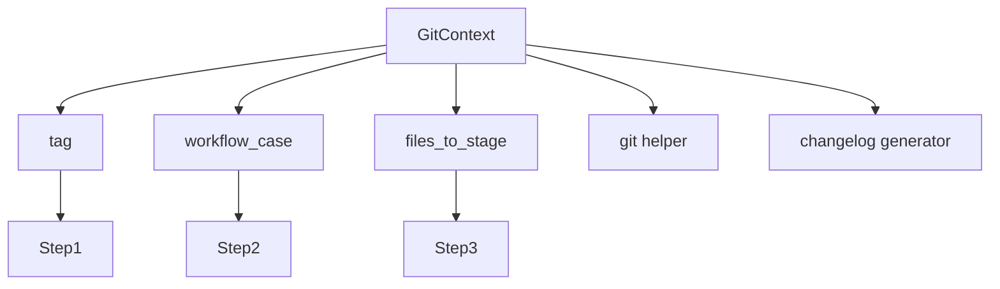
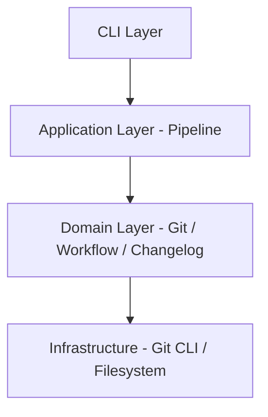

<!-- docs/guides/GitWorkflowEngine/custy_pipeline_system/architecture_diagram.md -->

# 🏗️ Architecture Diagram — Custy Pipeline System

---

## 📌 High-Level Architecture

```mermaid
flowchart TD
    CLI[CLI Command] --> Tool[GitCommitTagger]

    Tool --> Builder[PipelineBuilder]
    Builder --> Pipeline

    Pipeline --> Step1[ValidateStep]
    Pipeline --> Step2[WorkflowInitStep]
    Pipeline --> Step3[EditCommitStep]
    Pipeline --> Step4[ChangelogStep]
    Pipeline --> Step5[CommitStep]
    Pipeline --> Step6[TagStep]
    Pipeline --> Step7[BackupStep]
    Pipeline --> Step8[PushStep]
    Pipeline --> Step9[CleanupStep]
    Pipeline --> Step10[FinalizeStep]

    Step1 --> Domain1[GitHelper]
    Step3 --> Domain2[ReleaseNoteBuilder]
    Step4 --> Domain3[ChangelogGenerator]
    Step5 --> Domain4[GitHelper]
    Step6 --> Domain4
    Step7 --> Domain5[BackupManager]
    Step9 --> Domain6[BranchCleaner]
    Step10 --> Domain7[WorkflowManager]
````

---

## 🔁 Pipeline Execution Flow

```mermaid
flowchart TD
    A[Start] --> B[Validate]
    B --> C[Workflow Init]
    C --> D[Edit Commit Message]
    D --> E[Generate Changelog]
    E --> F[Stage Files]
    F --> G[Commit]
    G --> H[Tag]
    H --> I[Backup]
    I --> J[Push]
    J --> K[Cleanup]
    K --> L[Finalize Workflow]
    L --> M[Done]
```

---

## 🧩 Step Lifecycle

```mermaid
flowchart TD
    A[Pipeline.run()] --> B[Loop Steps]

    B --> C[Step.execute(ctx)]
    C --> D{Success?}

    D -->|Yes| E[Next Step]
    D -->|No| F[Stop Pipeline]

    E --> B
```

---

## 🧠 Step Registry (Plugin System)

```mermaid
flowchart TD
    A[StepRegistry] --> B[register(name, step)]
    A --> C[get(name)]
    C --> D[Create Step Instance]

    D --> E[Pipeline Builder]
```

---

## 🏗️ Pipeline Builder

```mermaid
flowchart TD
    A[Pipeline Config] --> B[Builder]

    B --> C[Resolve Step Name]
    C --> D[StepRegistry.get()]
    D --> E[Instantiate Step]

    E --> F[Add to Pipeline]
```

---

## 📦 Context Flow



---

## 🧱 Layered Architecture



---

## 🔄 Strategy Pattern (Versioning)

```mermaid
flowchart TD
    A[Version Strategy] --> B[PEP440Strategy]
    A --> C[SemverStrategy]
    A --> D[CommitizenStrategy]

    B --> E[get_next_tag()]
    C --> E
    D --> E
```

---

## 🎯 Summary

* Pipeline = orchestration
* Steps = execution units
* Context = shared state
* Registry = plugin system
* Builder = pipeline constructor

This architecture enables:

* modular development
* flexible workflows
* easy extensibility

```
