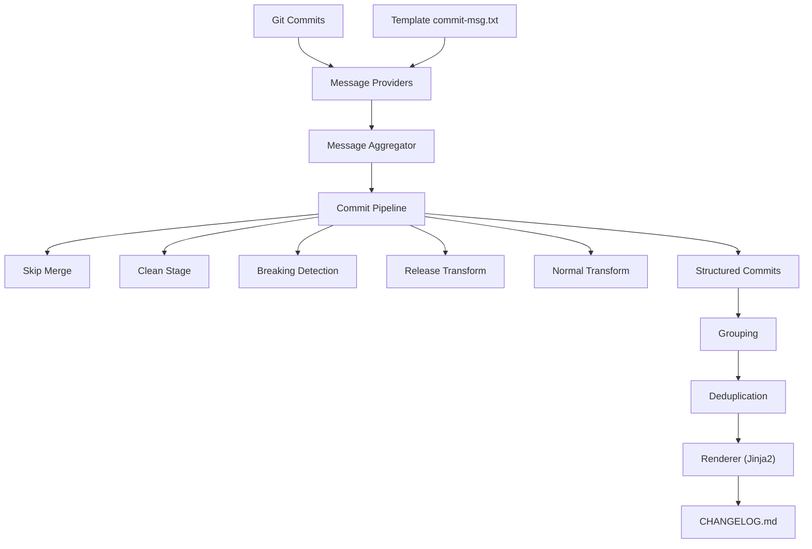
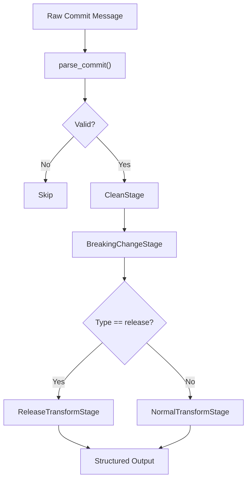
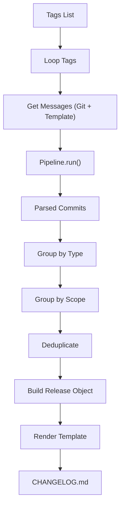
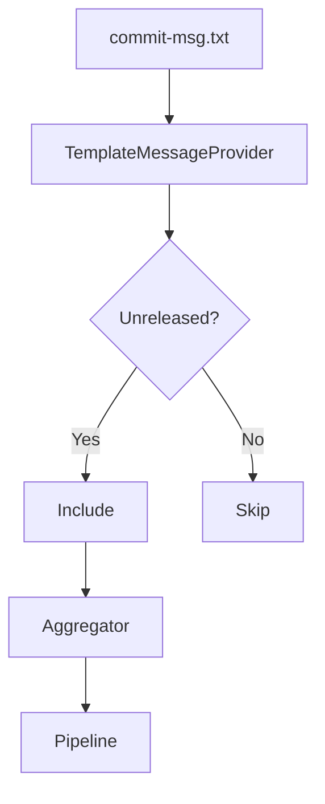
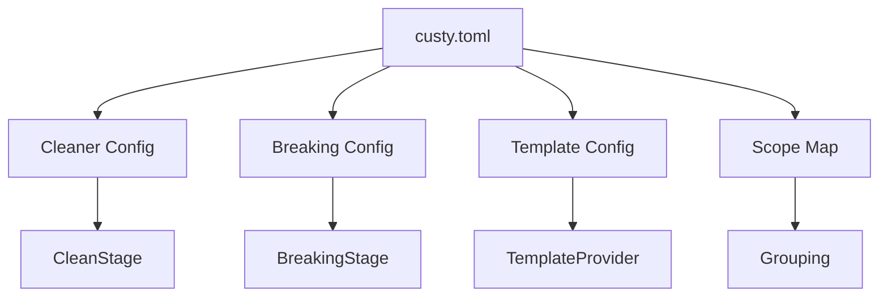

<!-- docs/guides/changelog/diagrams/DIAGRAMS.md -->

# 🔄 1. System Overview

## 🧩 Mermaid Diagram



---

## 🧾 ASCII Diagram (Fallback)

```
Git Commits ───────┐
                   ├──► Message Providers ───► Aggregator ───► Pipeline ───► Group ───► Render ───► CHANGELOG.md
Template Message ──┘
```

---

# 🔁 2. Commit Processing Flow

## 🧩 Mermaid



---

## 🧾 ASCII

```
Raw Message
   ↓
parse_commit
   ↓
Clean
   ↓
Breaking Detection
   ↓
[Release?]
   ├── Yes → ReleaseTransform
   └── No  → NormalTransform
   ↓
Structured Commit
```

---

# 🧾 3. Changelog Generation Flow

## 🧩 Mermaid



---

## 🧾 ASCII

```
Tags
  ↓
Loop
  ↓
Get Messages
  ↓
Pipeline
  ↓
Group
  ↓
Deduplicate
  ↓
Render
  ↓
CHANGELOG.md
```

---

# 🧠 4. Template Integration Flow

## 🧩 Mermaid



---

## 🧾 ASCII

```
commit-msg.txt
      ↓
Template Provider
      ↓
[Unreleased Only]
      ↓
Aggregator
      ↓
Pipeline
```

---

# ⚙️ 5. Configuration Influence Flow

## 🧩 Mermaid



---

## 🧾 ASCII

```
custy.toml
   ├── cleaning → CleanStage
   ├── breaking → BreakingStage
   ├── template → TemplateProvider
   └── scope_map → Grouping
```

---

# 🖼️ 6. Image Diagram (Export Version)

Use this description if you want to generate a PNG (e.g., draw.io / Excalidraw / Figma):

---

## 🎨 System Diagram (Image Layout)

```
[Git Commits]        [Template File]
       │                     │
       └──────► [Providers] ◄┘
                     │
              [Aggregator]
                     │
               [Pipeline]
     ┌─────────┬──────────┬──────────┬──────────┐
     │ Skip    │ Clean    │ Breaking │ Transform│
     └─────────┴──────────┴──────────┴──────────┘
                     │
               [Structured Data]
                     │
               [Grouping]
                     │
              [Deduplication]
                     │
                [Renderer]
                     │
              [CHANGELOG.md]
```

---

# 🎯 Notes

* Mermaid diagrams work in:

  * GitHub
  * VSCode (Markdown Preview)
* ASCII diagrams work everywhere
* Image layout can be recreated in:

  * draw.io
  * Figma
  * Excalidraw

---

# 🚀 Summary

Now there are:

* System overview diagram
* Pipeline flow diagram
* Changelog generation flow
* Template integration flow
* Config influence flow
* Image-ready diagram

These diagrams help:

* onboarding developers
* explaining architecture
* debugging flow
