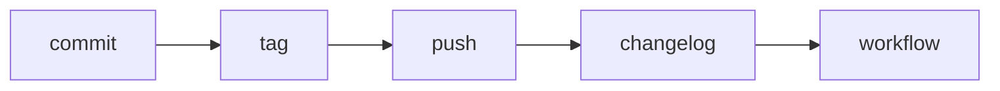

<!-- docs/guides/cli/1/ALL.md -->

Below are **ready-to-use Markdown docs** for your `docs/` folder. They’re structured, practical, and aligned with your current Custy architecture (Typer + context + pipeline + services + Rich UI).

---

# 📄 `docs/developer_guide.md`

```md
# 🧑‍💻 Custy Developer Guide

This document helps developers understand how to work with Custy CLI, extend features, and follow consistent patterns.

---

## 🎯 Core Principles

Custy follows these principles:

- **Atomic Commands** → Each command does one thing
- **Pipeline Execution** → Combine commands dynamically
- **Separation of Concerns** → CLI ≠ Business Logic
- **Context-driven Execution** → Shared runtime state
- **User-friendly Output** → Clean CLI UX (no raw tracebacks)

---

## 📁 Project Overview

```

app/
├── cli/           # CLI layer (Typer)
├── services/      # Business logic
├── utils/         # Helpers (runner, progress, etc.)
├── theme/         # Styling system
├── errors/        # Custom exceptions

```

---

## 🧠 Execution Flow

1. CLI starts (`__main__.py`)
2. `@app.callback()` initializes context
3. Command is executed
4. Context is accessed via `get_context()`
5. Service layer is called
6. Output formatted via Rich

---

## ⚙️ Adding a New Command

### Step 1 — Create service logic

```

app/services/my_service.py

````

```python
def do_something():
    ...
````

---

### Step 2 — Create CLI command

```
app/cli/commands/my_command.py
```

```python
import typer
from app.services.my_service import do_something

def my_command(ctx: typer.Context):
    do_something()
```

---

### Step 3 — Register command

```
app/cli/main.py
```

```python
app.command()(my_command)
```

---

## 🔄 Using Context

Always access context like this:

```python
from app.cli.context import get_context

def command(ctx: typer.Context):
    app_ctx = get_context(ctx)
```

### Available properties:

| Property    | Description                  |
| ----------- | ---------------------------- |
| `dry_run`   | simulate execution           |
| `debug`     | show full traceback          |
| `validated` | prevent duplicate validation |

---

## 🛡️ Validation Pattern

Do NOT use:

```python
print("error")
sys.exit(1)
```

Use:

```python
raise ValidationError("Message", hint="Fix suggestion")
```

Handled in CLI layer → clean output.

---

## 🔁 Pipeline Execution

Use:

```bash
custy run commit tag push
```

Internally:

```python
PIPELINE = {
    "commit": commit_changes,
    "tag": tag_bump,
}
```

---

## 📊 Progress Execution

Use reusable helper:

```python
run_steps("Title", [
    ("Step 1", func1),
    ("Step 2", lambda: func2(arg)),
])
```

---

## 🎨 Styling

Use semantic styles:

```python
console.print("[success]Done")
console.print("[error]Failed")
```

DO NOT hardcode colors like `[green]`.

---

## ⚠️ Common Mistakes

| Mistake               | Fix              |
| --------------------- | ---------------- |
| Using `print()`       | Use Rich console |
| Using `sys.exit()`    | Raise exception  |
| Hardcoding colors     | Use theme        |
| Business logic in CLI | Move to services |

---

## 🚀 Recommended Workflow

```bash
custy run validate commit tag push changelog
```

---

## 🧩 Summary

* CLI = orchestration
* Services = logic
* Context = state
* Theme = UI consistency
* Pipeline = flexibility

````

---

# 📄 `docs/architecture_overview.md`

```md
# 🏗️ Custy Architecture Overview

This document explains the system design and architecture of Custy CLI.

---

## 🧠 High-Level Design

Custy is designed as a **layered CLI system**:

````

CLI Layer (Typer)
↓
Context Layer
↓
Service Layer
↓
Utility Layer

```

---

## 📦 Layers Explained

### 1. CLI Layer

- Handles user input
- Defines commands
- Formats output

Location:
```

app/cli/

````

---

### 2. Context Layer

Shared runtime state:

```python
class AppContext:
    dry_run: bool
    debug: bool
    validated: bool
````

---

### 3. Service Layer

Core logic:

* Git operations
* Validation
* Changelog
* Workflow

Location:

```
app/services/
```

---

### 4. Utility Layer

Reusable helpers:

* Progress runner
* Subprocess runner
* Config loader

---

## 🔄 Execution Lifecycle

1. CLI invoked
2. Context initialized
3. Command triggered
4. Validation (optional)
5. Service executed
6. Output rendered

---

## 🔗 Pipeline System

Instead of many commands:

```bash
custy run commit tag push
```

Pipeline registry:

```python
PIPELINE = {
    "commit": func,
    "tag": func,
}
```

---

## 🛡️ Error Handling Strategy

| Layer   | Responsibility   |
| ------- | ---------------- |
| Service | raise exceptions |
| CLI     | format output    |

---

## 🎨 UI System

* Built with Rich
* Uses semantic theming
* Centralized styling

---

## ⚙️ Design Decisions

### Why not many commands?

→ Avoid combinatorial explosion

---

### Why pipeline?

→ Flexible and scalable

---

### Why context?

→ Shared state across execution

---

## 🧩 Summary

* Modular architecture
* Clear separation of concerns
* Extensible design

````

---

# 📄 `docs/system_core.md`

```md
# ⚙️ System Core Design

This document focuses on the internal core systems of Custy.

---

## 🔁 Pipeline Engine

The pipeline engine allows dynamic execution:

```bash
custy run commit tag push
````

---

### Registry

```python
PIPELINE = {
    "commit": commit_changes,
    "tag": tag_bump,
}
```

---

### Execution

```python
for step in steps:
    PIPELINE[step]()
```

---

## 🧠 Context System

Context ensures consistent execution:

```python
ctx.obj = AppContext()
```

---

### Usage

```python
app_ctx = get_context(ctx)
```

---

## 📊 Step Runner

Reusable execution helper:

```python
run_steps(title, steps)
```

Supports:

* progress bar
* error handling
* step tracking

---

## 🛡️ Error System

Custom exceptions:

```python
class ValidationError(Exception):
```

---

## 🎨 Theme System

Centralized styling:

```python
console = Console(theme=theme.to_rich_theme())
```

---

## 🔄 Validation System

Split into atomic functions:

```python
ensure_git_repo()
ensure_version_file()
```

---

## 🧩 Design Pattern Used

| Pattern          | Usage         |
| ---------------- | ------------- |
| Command Pattern  | CLI commands  |
| Pipeline Pattern | run execution |
| Decorator        | validation    |
| Strategy         | versioning    |
| Facade           | service layer |

---

## 🚀 Summary

Core system is:

* modular
* testable
* extensible

````

---

# 📄 `docs/mermaid_flow.md`

```md
# 🧩 Custy Execution Flow (Mermaid)

```mermaid
flowchart TD

A[User runs CLI] --> B[Typer App Start]
B --> C[Initialize Context]

C --> D{Command Type}

D -->|Single Command| E[Execute Command]
D -->|Pipeline| F[Parse Steps]

F --> G[Load Pipeline Registry]

G --> H[Execute Steps Loop]

H --> I[Run Validation if needed]
I --> J[Execute Service Function]

J --> K{Error?}

K -->|Yes| L[Format Error Output]
K -->|No| M[Continue]

M --> N[Next Step]

N --> O{More Steps?}
O -->|Yes| H
O -->|No| P[Finish Execution]

P --> Q[Show Success Output]
````

---

## 🧠 Validation Flow

```mermaid
flowchart TD

A[Start Validation] --> B[Check Git Repo]
B --> C[Check Version File]
C --> D[Check Message File]
D --> E[Check Tag File]
E --> F[Check Staged Changes]
F --> G[Check Remote Origin]
G --> H[Validation Complete]
```

---

## 🔁 Pipeline Example



```

---

# ✅ What You Now Have

You now have:

- ✅ Developer Guide
- ✅ Architecture Overview
- ✅ Core System Design
- ✅ Mermaid Diagrams (ready for `.mmd` or export)

---

If you want next level:
- CLI help docs (user-facing)
- Rich UI design spec
- Plugin system design (future-proof)

Just say 👍
```
