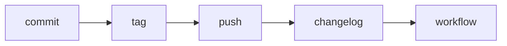

<!-- docs/guides/cli/1/mermaid_flow.md -->

# 🧩 Custy Execution Flow (Mermaid)

```mermaid
flowchart TD

A[User runs CLI] --> B[Typer App Start]
B --> C[Initialize Context]

C --> D{Command Type}

D -->|Single Command| E[Execute Command]
D -->|Pipeline| F[Parse Steps]

F --> G[Load Pipeline Registry]

G --> H[Execute Steps Loop]

H --> I[Run Validation if needed]
I --> J[Execute Service Function]

J --> K{Error?}

K -->|Yes| L[Format Error Output]
K -->|No| M[Continue]

M --> N[Next Step]

N --> O{More Steps?}
O -->|Yes| H
O -->|No| P[Finish Execution]

P --> Q[Show Success Output]
````

---

## 🧠 Validation Flow

```mermaid
flowchart TD

A[Start Validation] --> B[Check Git Repo]
B --> C[Check Version File]
C --> D[Check Message File]
D --> E[Check Tag File]
E --> F[Check Staged Changes]
F --> G[Check Remote Origin]
G --> H[Validation Complete]
```

---

## 🔁 Pipeline Example


