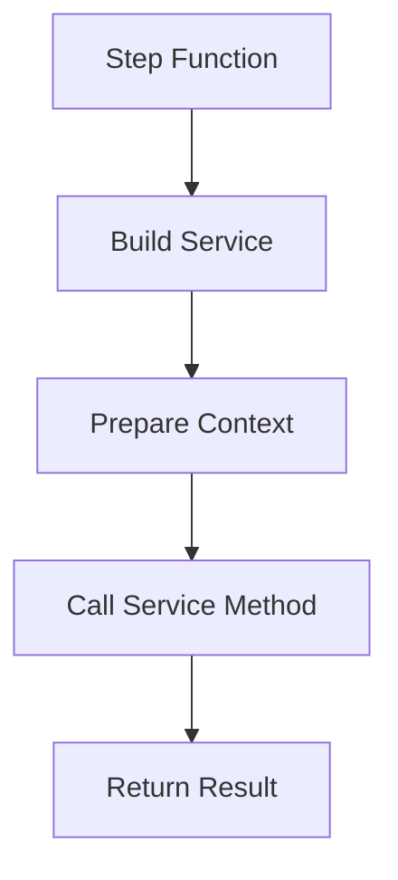
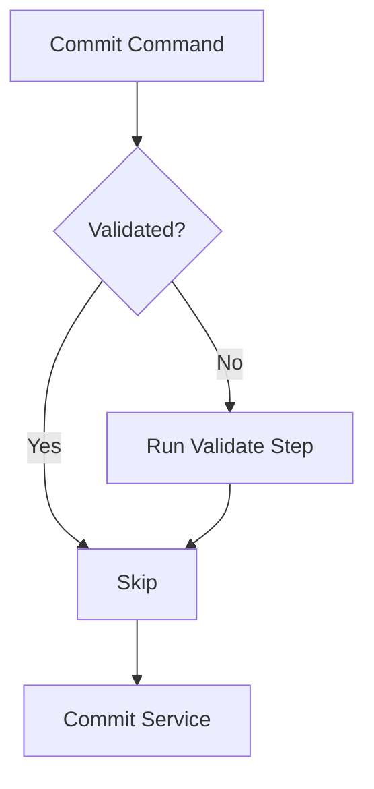

<!-- docs/guides/cli/2/ALL.md -->

Below are **ready-to-use Markdown docs** you can drop into your `docs/` folder. They’re structured, consistent, and tailored to your current architecture (Typer CLI + pipeline + context + steps + services + decorators + registry + Rich).

---

# 📄 `docs/architecture.md`

```md
# 🏗️ Custy CLI Architecture

Custy is a modular CLI tool designed for Git automation, versioning, changelog generation, and workflow orchestration.

This document explains the **core architecture**, how components interact, and the design principles behind the system.

---

## 🎯 Design Goals

- Clear separation of concerns
- Pipeline-driven execution
- Scalable and extensible
- Consistent CLI experience
- Decoupled from Typer in core logic

---

## 🧱 High-Level Architecture

```

CLI (Typer)
↓
Context (AppContext)
↓
Pipeline (run / registry)
↓
Step Layer (adapters)
↓
Service Layer (business logic)

```

---

## 🧩 Core Components

### 1. CLI Layer (Typer)

Handles:
- Parsing user input
- CLI options & arguments
- Command routing

Example:
```

custy commit
custy run commit tag push
custy changelog generate

````

---

### 2. Context Layer (`AppContext`)

Acts as shared runtime state across all steps.

Contains:
- global flags (`dry_run`, `debug`, `log_level`)
- shared inputs (`commit_message_file`, etc.)
- runtime state (`validated`)
- resolved args

---

### 3. Registry (`registry.py`)

Maps pipeline step names → executable functions.

Example:
```python
PIPELINE = {
    "validate": validate_step,
    "commit": commit_changes,
}
````

Also defines presets:

```python
PRESETS = {
    "release": ["validate", "commit", "tag", "push"]
}
```

---

### 4. Pipeline (`run` command)

Responsible for:

* expanding presets
* resolving steps
* executing steps sequentially

Example:

```
custy run commit tag push
```

---

### 5. Step Layer

Acts as adapter between pipeline and services.

Responsibilities:

* build service instances
* prepare inputs
* call service methods

---

### 6. Service Layer

Contains core business logic.

Examples:

* `ValidationService`
* `ChangelogService`
* `WorkflowService`

Services:

* do NOT depend on Typer
* operate using `AppContext` + resolved args

---

### 7. Decorators

Used in CLI layer only.

Example:

```python
@require_validation
def commit(...):
```

⚠️ Important:

* Decorators DO NOT run in pipeline mode
* Pipeline must handle dependencies separately

---

### 8. Rich (Output Layer)

Used for:

* colored logs
* structured output
* better UX

---

## 🔁 Execution Modes

### 1. Direct Command

```
custy commit
```

Flow:

```
CLI → decorator → step/service
```

---

### 2. Pipeline Mode

```
custy run commit tag push
```

Flow:

```
CLI → run → registry → step → service
```

---

## ⚠️ Important Design Rules

### Rule 1: Services must be CLI-independent

❌ Bad:

```python
def commit(ctx: typer.Context)
```

✅ Good:

```python
def commit(ctx: AppContext)
```

---

### Rule 2: Steps are required for class-based services

Pipeline should NOT call class methods directly.

---

### Rule 3: Context is the single source of truth

Avoid multiple sources:

* CLI args
* service args
* global variables

Use `AppContext` instead.

---

## 🚀 Future Extensions

* Step dependency system
* Config-driven pipeline (`custy.yml`)
* Plugin system
* Middleware hooks

---

## 📌 Summary

Custy uses a layered architecture:

* CLI handles input
* Context stores state
* Pipeline orchestrates execution
* Steps adapt logic
* Services execute business rules

This ensures scalability, maintainability, and clarity.

````

---

# 📄 `docs/developer_guide.md`

```md
# 👨‍💻 Developer Guide

This guide explains how to extend Custy CLI safely and consistently.

---

## 🧩 Adding a New Command

### Step 1: Create CLI command

```python
@app.command()
def my_command(ctx: typer.Context):
    app_ctx = get_context(ctx)
    my_service(app_ctx)
````

---

### Step 2: Add service logic

```python
def my_service(ctx: AppContext):
    ...
```

---

### Step 3 (optional): Add step for pipeline

```python
def my_step(ctx: AppContext):
    my_service(ctx)
```

---

### Step 4: Register in pipeline

```python
PIPELINE["my-step"] = my_step
```

---

## 🧩 Adding a New Pipeline Step

1. Create step function
2. Register in `registry.py`
3. Ensure it accepts `AppContext`

---

## 🧩 Adding a Service

Use class if:

* complex logic
* reusable
* needs internal state

Example:

```python
class MyService:
    def run(self, ctx: AppContext):
        ...
```

---

## 🧩 Context Usage

Always use:

```python
app_ctx = get_context(ctx)
```

Never pass raw CLI args directly to services.

---

## 🧩 Logging

Use structured logging (Rich if enabled):

```python
logger.info("[primary]Running step...[/primary]")
```

---

## 🧩 Best Practices

* Keep services pure
* Keep steps thin
* Avoid duplicating logic in CLI + pipeline
* Use context consistently

---

## ⚠️ Common Mistakes

❌ Calling service with `typer.Context`
❌ Skipping context
❌ Mixing CLI args and service args

---

## ✅ Summary

* CLI = input
* Context = state
* Step = adapter
* Service = logic

````

---

# 📄 `docs/pipeline.md`

```md
# 🔁 Pipeline System

The pipeline system allows executing multiple steps in sequence.

---

## 🧠 Concept

Pipeline = sequence of steps executed via `run` command.

---

## ▶️ Usage

```bash
custy run commit tag push
````

---

## 🧩 Steps

Defined in `registry.py`:

```python
PIPELINE = {
    "commit": commit_changes,
}
```

---

## 🧩 Presets

```python
PRESETS = {
    "release": ["validate", "commit", "tag", "push"]
}
```

---

## 🔄 Execution Flow

1. Parse steps
2. Expand presets
3. Resolve functions
4. Execute sequentially

---

## ⚠️ Important

* Steps must accept `AppContext`
* Steps must be independent
* No Typer dependency

---

## 🚀 Future Improvements

* Step dependencies
* Parallel execution
* Conditional steps

````

---

# 📄 `docs/flow_diagram.md` (Mermaid-ready)

```md
# 🧩 System Flow Diagram

## 🧩 Mermaid

```mermaid
flowchart TD

A[CLI Input] --> B[Typer Command]
B --> C[AppContext Created]

C --> D{Mode?}

D -->|Direct Command| E[Decorator]
E --> F[Step]
F --> G[Service]

D -->|Pipeline| H[Run Command]
H --> I[Expand Presets]
I --> J[Registry Lookup]
J --> K[Step Layer]
K --> G

G --> L[Rich Output]
````

---

## 🧩 Pipeline Detail

```mermaid
flowchart TD

A[Run Command] --> B[Parse Steps]
B --> C[Expand Presets]
C --> D[Resolve Functions]

D --> E[Step 1]
E --> F[Step 2]
F --> G[Step N]

G --> H[Execution Complete]
```

---

## 🧩 Step Execution



---

## 🧩 Validation Flow



````

---

# 📄 Optional: `docs/cli_usage.md`

```md
# 🧑‍💻 CLI Usage

---

## Basic Commands

````

custy validate
custy commit
custy tag
custy push

```

---

## Pipeline

```

custy run commit tag push
custy run release
custy run full

```

---

## Changelog

```

custy changelog generate
custy changelog preview
custy changelog validate

```

---

## Backup & Cleanup

```

custy backup commit
custy cleanup branches

```

---

## Global Options

```

--dry-run
--debug
--log-level

```

---

## Examples

```

custy run commit tag push --dry-run
custy commit -m "feat: add login"

```
```

---

# 🎯 Final Result

You now have:

* `architecture.md` → system design
* `developer_guide.md` → how to extend
* `pipeline.md` → pipeline explanation
* `flow_diagram.md` → Mermaid diagrams
* `cli_usage.md` → user guide

---

If you want next level, I can help you:

* generate **README.md (GitHub-ready)**
* add **Rich-styled CLI help output**
* create **auto-doc generator from registry**

Just tell me 👍
