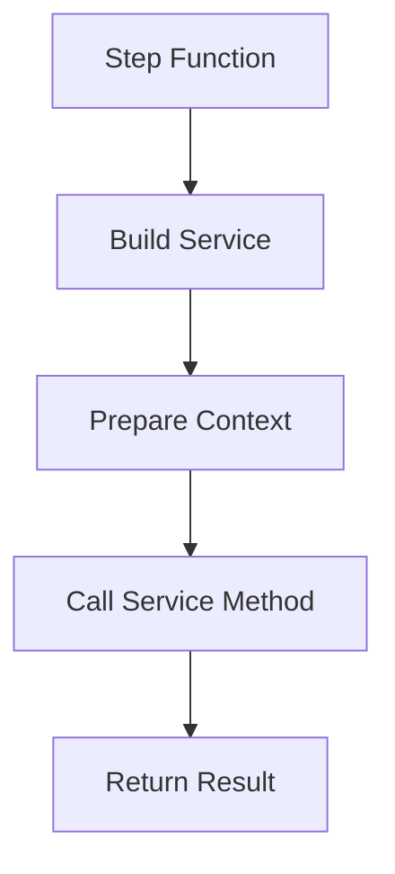
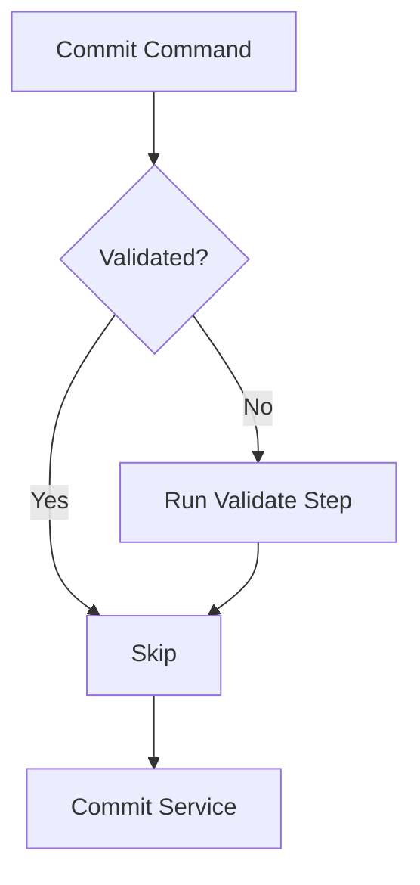

<!-- docs/guides/cli/2/flow_diagram.md -->

# 🧩 System Flow Diagram

## 🧩 Mermaid

```mermaid
flowchart TD

A[CLI Input] --> B[Typer Command]
B --> C[AppContext Created]

C --> D{Mode?}

D -->|Direct Command| E[Decorator]
E --> F[Step]
F --> G[Service]

D -->|Pipeline| H[Run Command]
H --> I[Expand Presets]
I --> J[Registry Lookup]
J --> K[Step Layer]
K --> G

G --> L[Rich Output]
````

---

## 🧩 Pipeline Detail

```mermaid
flowchart TD

A[Run Command] --> B[Parse Steps]
B --> C[Expand Presets]
C --> D[Resolve Functions]

D --> E[Step 1]
E --> F[Step 2]
F --> G[Step N]

G --> H[Execution Complete]
```

---

## 🧩 Step Execution



---

## 🧩 Validation Flow


