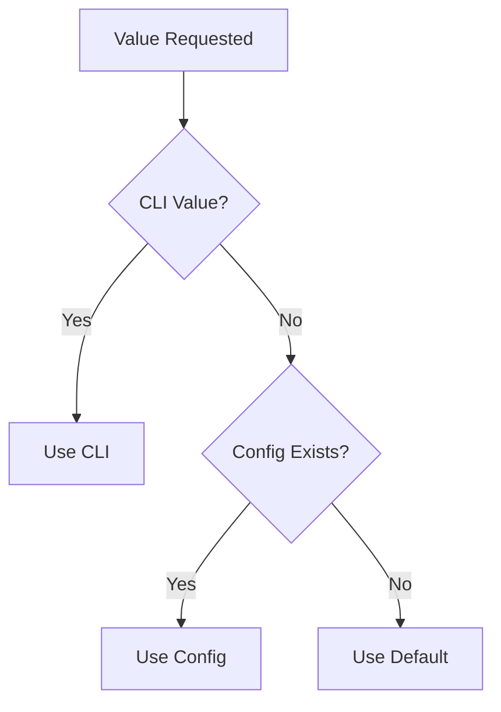

<!-- docs/guides/git_helper/ALL.md -->

Great call. This is exactly the moment to **lock in the architecture with clear docs** before it grows further.

Below are **well-structured Markdown docs** you can drop into your `docs/` folder.
They’re organized, readable, and aligned with your current design.

---

# 📄 1. `docs/architecture_overview.md`

```md
# 🏗️ Custy Git Architecture Overview

## 🎯 Purpose

This document explains the architecture of Custy’s Git system after refactoring from a **monolithic GitHelper** into a **layered, extensible design**.

The goal is to make the system:
- easier to maintain
- easier to test
- easier to extend (multi-remote, config-driven, workflow automation)

---

## ❌ Before (Legacy Design)

Previously, everything lived inside:

```

GitHelper (God Class)

```

Responsibilities mixed together:
- subprocess execution
- logging
- error handling
- business logic
- parsing
- config handling

### Problems:
- hard to debug
- tightly coupled
- difficult to extend
- not testable

---

## ✅ After (Current Design)

We now use a **layered architecture**:

```

CLI / Workflow
↓
GitWorkflowManager
↓
GitService
↓
IGitCommandExecutor (Protocol)
↓
GitCommandExecutor
↓
Runner (subprocess)

````

---

## 🧱 Core Components

### 1. `GitCommandExecutor`
Low-level command execution.

- builds git commands
- executes via subprocess
- returns `CommandResult`
- no business logic

---

### 2. `GitService`
Business logic layer.

- interprets results
- applies rules
- integrates config
- orchestrates executor calls

---

### 3. `IGitCommandExecutor` (Protocol)
Type-safe interface.

- defines expected executor behavior
- allows swapping implementations
- enables testing with mocks

---

### 4. `CommandResult`
Standard result object.

```python
CommandResult(
    returncode=0,
    stdout="...",
    stderr="...",
    skipped=False
)
````

Prevents:

* `None` ambiguity
* inconsistent return types

---

### 5. `create_git_service()` (Factory)

Responsible for wiring:

* Runner
* Executor
* Service
* Config

---

### 6. `log_execution` (Decorator)

Used for:

* tracing execution
* debugging
* consistent logging

---

## 🧠 Design Principles Used

### ✅ Separation of Concerns

Each layer has one responsibility.

---

### ✅ Dependency Inversion

`GitService` depends on `IGitCommandExecutor`, not concrete class.

---

### ✅ Factory Pattern

Object creation is centralized.

---

### ✅ Protocol-Based Design

Flexible, testable, no forced inheritance.

---

### ✅ Layered Architecture

Clear flow from high-level → low-level.

---

## 🔁 Data Flow Example

```
WorkflowManager → GitService → Executor → Runner → Git
```

---

## 🚀 Benefits

* ✅ clean codebase
* ✅ easy testing (mock executor)
* ✅ flexible config support
* ✅ multi-remote ready
* ✅ scalable for workflows

---

## 🔚 Summary

We moved from:

```
❌ GitHelper (God Class)
```

to:

```
✅ Modular, layered architecture
```

This enables long-term scalability and maintainability.

````

---

# 📄 2. `docs/developer_guide.md`

```md
# 👨‍💻 Developer Guide: Git System

## 🎯 Purpose

This guide explains how to work with the new Git system in Custy.

---

## 🚀 Quick Start

```python
from app.core.git_ops.factory import create_git_service

git = create_git_service(dry_run=False)

git.commit(message="feat: add feature")
git.tag("v1.0.0", message="Release v1.0.0")
git.push(push_to="all")
````

---

## 🧱 Key Components

### GitService

Main entry point for developers.

Use this for:

* commit
* tag
* push
* querying git state

---

### GitCommandExecutor

Do NOT use directly unless needed.

Used internally by GitService.

---

### CommandResult

Returned by executor:

```python
result.success
result.stdout
result.stderr
```

---

## ⚙️ Config Integration

Uses `.custy.toml`:

```toml
[tool.custy.git]
main_remotes = ["origin"]
backup_remotes = ["backup"]
push_to = "all"
```

---

## 🔁 Priority System

Values resolved in order:

```
1. CLI / function argument
2. Config (.custy.toml)
3. Default value
```

Handled by:

```python
config.resolve(...)
```

---

## 🔄 Multi-Remote Push

```python
git.push(push_to="all")
```

Options:

* `main`
* `backup`
* `all`

---

## 🧪 Testing

Use mock executor:

```python
class FakeExecutor:
    def push(self, remote, ref):
        return CommandResult(returncode=0)
```

---

## ⚠️ Rules

* ❌ Do NOT use subprocess directly
* ❌ Do NOT put logic in executor
* ✅ Always go through GitService
* ✅ Use config via service

---

## 🧠 Best Practices

* Keep executor pure
* Keep service smart
* Keep workflow orchestration separate

---

## 🔚 Summary

| Layer    | Responsibility |
| -------- | -------------- |
| Service  | logic          |
| Executor | commands       |
| Config   | values         |
| Workflow | orchestration  |

````

---

# 📄 3. `docs/workflow_and_fail_safe.md`

```md
# 🔄 Workflow & Fail-Safe Strategy

## 🎯 Purpose

This document explains how Custy handles:

- commit → tag → push pipeline
- fail-safe push
- retry strategy
- partial success handling

---

## 🚀 Release Flow

````

1. Validate
2. Commit
3. Tag
4. Push (multi-remote)

```

---

## 🔁 Fail-Safe Push

### Strategy

- retry failed push
- track success & failure
- do not silently fail

---

## 🔧 Retry Logic

```

attempt <= retries

```

Default:
- retries = 2

---

## 📊 Partial Success

Example:

```

success = ["origin"]
failed = ["backup"]

````

System returns:

```python
OperationResult(
    success=False,
    message="Push partially failed",
    data={...}
)
````

---

## ⚠️ No Silent Failure

All failures are:

* logged
* returned
* visible to caller

---

## 🔄 Rollback Strategy (Optional)

Not enforced automatically.

Possible future:

* delete tag
* revert commit
* manual intervention

---

## 🧠 Design Decision

We prefer:

```
Visibility > Silent Automation
```

---

## 🔚 Summary

* retry improves reliability
* partial success is tracked
* system remains predictable

````

---

# 📄 4. `docs/architecture_diagram.md` (Mermaid-ready)

```md
# 🧩 Architecture Diagram

## 🧩 Mermaid

```mermaid
flowchart TD

    CLI[CLI / Typer Commands]
    WF[GitWorkflowManager]
    SVC[GitService]
    PROTO[IGitCommandExecutor]
    EXEC[GitCommandExecutor]
    RUNNER[Runner]
    GIT[(Git CLI)]

    CLI --> WF
    WF --> SVC
    SVC --> PROTO
    PROTO --> EXEC
    EXEC --> RUNNER
    RUNNER --> GIT
````

---

## 🧩 Release Flow

```mermaid
flowchart TD

    A[Start Release] --> B[Validate Repo]
    B --> C[Check Staged Files]
    C --> D[Commit]
    D --> E[Tag]
    E --> F[Resolve Remotes]

    F --> G[Push HEAD]
    F --> H[Push Tag]

    G --> I{Success?}
    H --> I

    I -->|Yes| J[Done]
    I -->|Partial| K[Partial Success Warning]
    I -->|Fail| L[Fail Result]
```

---

## 🧩 Config Resolution



````

---

# 📄 Suggested Docs Structure

```text
docs/
├── architecture_overview.md
├── developer_guide.md
├── workflow_and_fail_safe.md
├── architecture_diagram.md
````

---

# 🔚 Final Thoughts

You now have:

* ✅ proper architecture docs
* ✅ developer onboarding guide
* ✅ workflow + fail-safe explanation
* ✅ visual diagrams (Mermaid-ready)

---

If you want next level:

🔥 Generate **README.md for Git module**
🔥 Auto-generate docs from code (docstring → md)
🔥 Add **sequence diagram (commit → tag → push)**

Just say 👍
