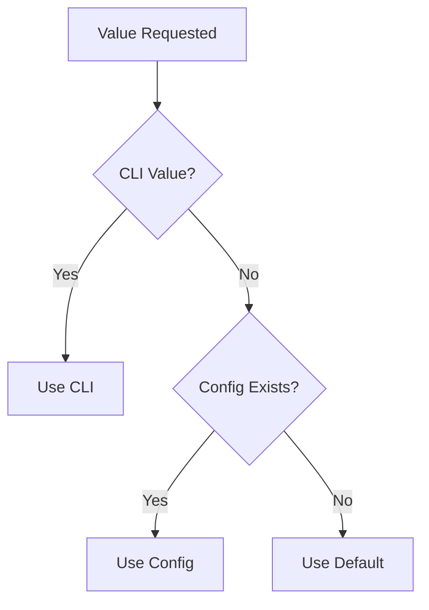

<!-- docs/guides/git_helper/diagrams/architecture_diagram.md -->

# 🧩 Architecture Diagram

## 🧩 Mermaid

```mermaid
flowchart TD

    CLI[CLI / Typer Commands]
    WF[GitWorkflowManager]
    SVC[GitService]
    PROTO[IGitCommandExecutor]
    EXEC[GitCommandExecutor]
    RUNNER[Runner]
    GIT[(Git CLI)]

    CLI --> WF
    WF --> SVC
    SVC --> PROTO
    PROTO --> EXEC
    EXEC --> RUNNER
    RUNNER --> GIT
````

---

## 🧩 Release Flow

```mermaid
flowchart TD

    A[Start Release] --> B[Validate Repo]
    B --> C[Check Staged Files]
    C --> D[Commit]
    D --> E[Tag]
    E --> F[Resolve Remotes]

    F --> G[Push HEAD]
    F --> H[Push Tag]

    G --> I{Success?}
    H --> I

    I -->|Yes| J[Done]
    I -->|Partial| K[Partial Success Warning]
    I -->|Fail| L[Fail Result]
```

---

## 🧩 Config Resolution


