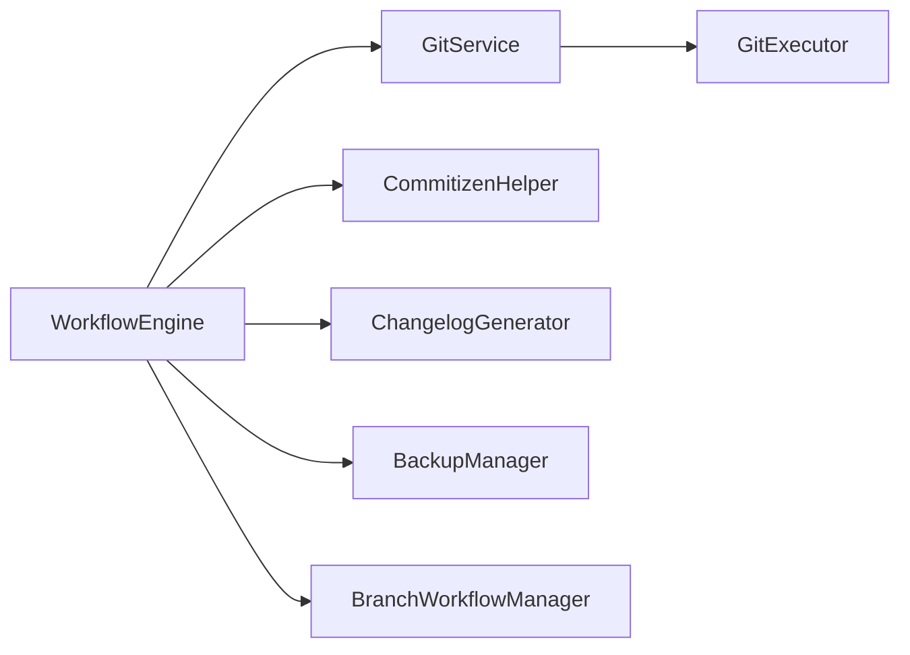
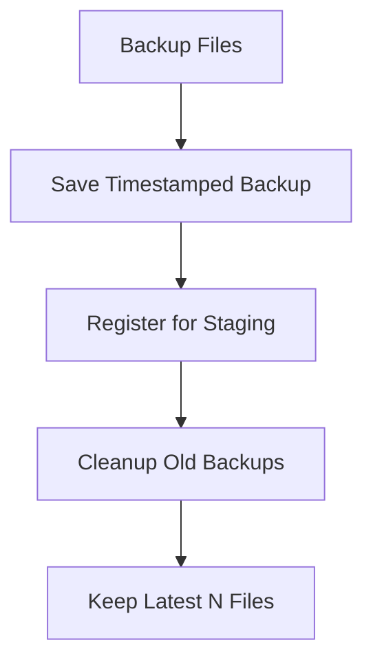
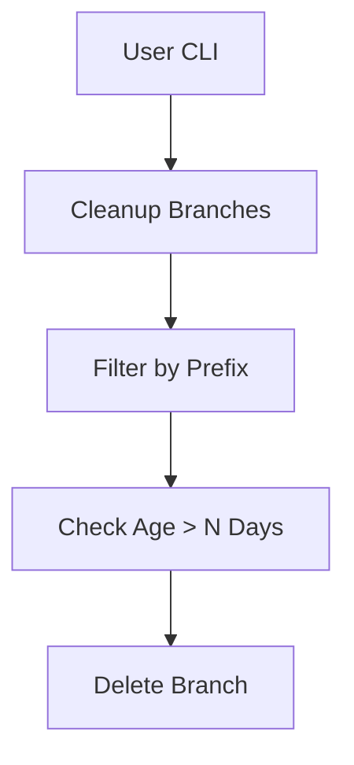

<!-- docs/guides/new_workflow_engine/ALL.md -->

Below are **two ready-to-use Markdown docs** you can place under your `docs/` folder:

1. `docs/workflow_engine.md` → system design & pipeline explanation
2. `docs/diagrams.md` → Mermaid diagrams (flow + architecture)

Both are written in a **semi-formal, developer-friendly** style and aligned with your current implementation.

---

# 📄 1. `docs/workflow_engine.md`

````md
# 🚀 Workflow Engine – Release Pipeline Design

This document describes the architecture and execution flow of the **WorkflowEngine**, which powers the full release automation pipeline in Custy.

---

## 🎯 Overview

The WorkflowEngine is responsible for orchestrating a complete release lifecycle:

- validating project state
- generating version & release artifacts
- handling user editing
- committing, tagging, and pushing changes
- executing workflow transitions (e.g., branch merges)

This is not a simple script—it is a **structured pipeline engine** with clear phases and responsibilities.

---

## 🧩 Core Concept

The system follows a **sequential pipeline model**, where each phase:

- has a single responsibility
- depends on previous phases
- can be extended or replaced

---

## 🔁 Full Pipeline Flow

```python
execute_release_workflow()
````

### Phases:

| Phase | Method                         | Description                   |
| ----- | ------------------------------ | ----------------------------- |
| 0     | `validate()`                   | Validate repo, files, config  |
| 1     | `prepare_version_tag()`        | Resolve next version          |
| 2     | `initialize_workflow()`        | Validate branch transition    |
| 3     | `prepare_tag_message()`        | Prepare tag message           |
| 4     | `generate_release_artifacts()` | Generate commit/tag templates |
| 5     | `edit_release_files()`         | User edits files              |
| 6     | `validate_edited_files()`      | Validate commit format        |
| 7     | `apply_version_updates()`      | Update version + changelog    |
| 8     | `backup_release_files()`       | Backup edited files           |
| 9     | `cleanup_backups()`            | Remove old backups            |
| 10    | `stage_changes()`              | Stage files                   |
| 11    | `execute_commit_phase()`       | Commit (strategy-aware)       |
| 12    | `create_tag()`                 | Create annotated tag          |
| 13    | `push_changes()`               | Push commit + tag             |
| 14    | `execute_post_workflow()`      | Final branch transitions      |

---

## 🔀 Commit Phase (Special Case)

The commit phase is **strategy-dependent**:

### Default Flow

```python
create_commit()
```

### Commitizen Flow

```python
self.cz.commit()
self.cz.check_commit()
```

This is handled via:

```python
execute_commit_phase()
```

---

## 🧠 Design Principles

### 1. Separation of Concerns

Each phase handles **one responsibility only**

---

### 2. Service-Based Architecture

Core operations are delegated to services:

* `GitService` → Git operations
* `CommitizenHelper` → commit strategy
* `ChangelogGenerator` → changelog
* `BackupManager` → backup lifecycle

---

### 3. Strategy Pattern

Versioning strategies:

* Semver
* PEP440
* Commitizen
* Date
* GitCount

---

### 4. Safe Execution

* supports `dry_run`
* controlled error handling via `ValidationError`
* avoids direct subprocess usage in workflow layer

---

## ⚠️ Out-of-Scope Step

### Branch Cleaner (Manual CLI)

There is an additional feature:

> **Branch Cleanup (Manual Only)**

Example:

* delete `feature/*` branches older than 30 days

This is intentionally **NOT part of the main workflow** because:

* it is destructive
* user-specific decision
* not tied to release lifecycle

---

## 📦 Example Usage

```python
engine.execute_release_workflow()
```

---

## 🔮 Future Improvements

* rollback system (commit/tag/push failure recovery)
* pipeline step registry system
* parallel push support
* interactive UI / preview mode

---

## 🧾 Summary

The WorkflowEngine provides:

* a clear release pipeline
* modular design
* flexible strategies
* safe execution

It is designed to be:

> scalable, maintainable, and production-ready

````

---

# 📄 2. `docs/diagrams.md`

```md
# 🧩 Workflow Engine Diagrams

This file contains visual representations of the release pipeline using **Mermaid**.

You can render these using:
- VSCode Mermaid Preview
- Mermaid CLI
- GitHub Markdown viewer

---

## 🚀 Full Pipeline Flow

```mermaid
flowchart TD

A[Start] --> B[Validate]
B --> C[Prepare Version Tag]
C --> D[Initialize Workflow]
D --> E[Prepare Tag Message]
E --> F[Generate Release Artifacts]
F --> G[Edit Files]
G --> H[Validate Edited Files]
H --> I[Apply Version Updates]
I --> J[Backup Files]
J --> K[Cleanup Backups]
K --> L[Stage Changes]

L --> M{Commit Strategy}

M -->|Default| N[Create Commit]
M -->|Commitizen| O[Commitizen Commit + Check]

N --> P[Create Tag]
O --> P

P --> Q[Push Changes]
Q --> R[Execute Post Workflow]
R --> S[End]
````

---

## 🔀 Commit Phase Detail

```mermaid
flowchart TD

A[Commit Phase] --> B{Strategy == commitizen && auto?}

B -->|Yes| C[cz.commit()]
C --> D[cz.check_commit()]

B -->|No| E[create_commit()]

D --> F[Continue Pipeline]
E --> F
```

---

## 🧠 Architecture Overview



---

## 🗂️ Backup & Cleanup Flow



---

## ⚠️ Manual Branch Cleaner (Out-of-Flow)



---

## 📌 Notes

* The main pipeline is **linear and deterministic**
* Commit phase is the only **branching logic**
* Backup + Cleanup ensures safe file handling
* Push phase supports **multi-remote**

---

## 🎯 Usage

You can export diagrams using:

```bash
mmdc -i diagrams.md -o diagrams.png
```

or render inside Markdown preview tools.

```

---

# ✅ What You Now Have

- ✔ Full system design documentation
- ✔ Clear pipeline explanation
- ✔ Mermaid diagrams (ready to render)
- ✔ Separation of manual vs automated steps
- ✔ Future-ready structure

---

If you want next level:

👉 I can generate **actual PNG/SVG diagram exports**
👉 Or convert this into **developer onboarding docs (HOW_TO_USE.md)**
```
