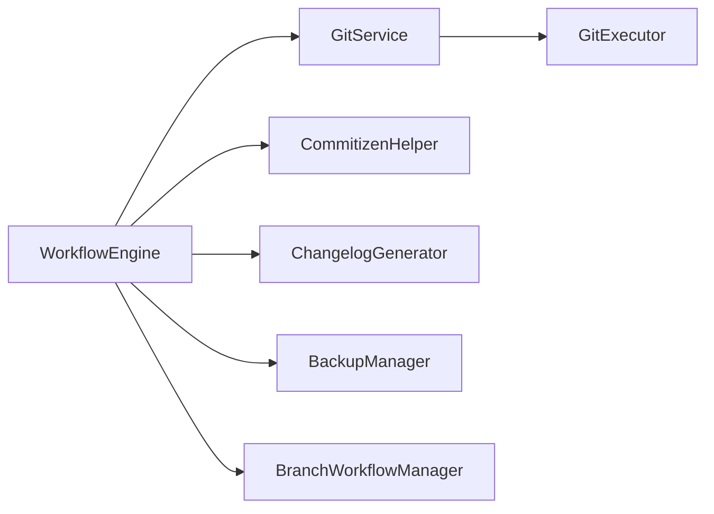
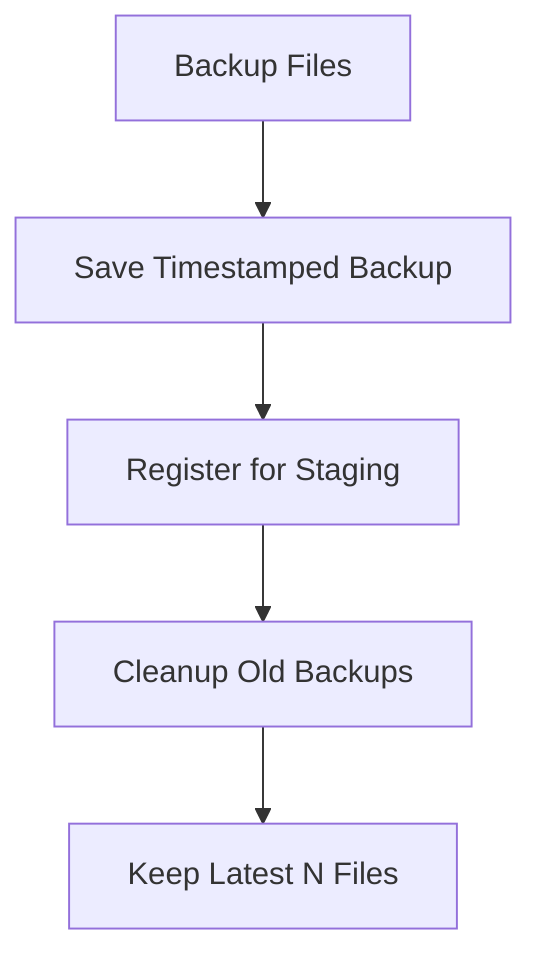
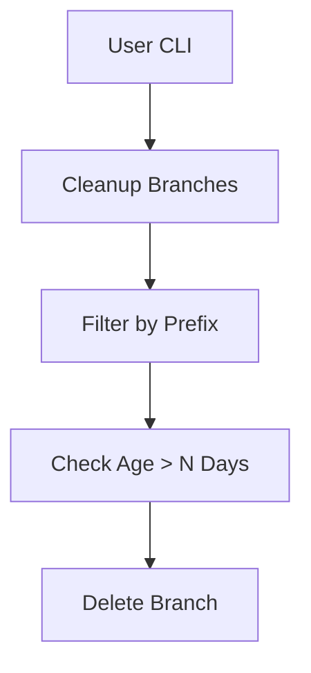

<!-- docs/guides/new_workflow_engine/diagrams.md -->

# 🧩 Workflow Engine Diagrams

This file contains visual representations of the release pipeline using **Mermaid**.

You can render these using:
- VSCode Mermaid Preview
- Mermaid CLI
- GitHub Markdown viewer

---

## 🚀 Full Pipeline Flow

```mermaid
flowchart TD

A[Start] --> B[Validate]
B --> C[Prepare Version Tag]
C --> D[Initialize Workflow]
D --> E[Prepare Tag Message]
E --> F[Generate Release Artifacts]
F --> G[Edit Files]
G --> H[Validate Edited Files]
H --> I[Apply Version Updates]
I --> J[Backup Files]
J --> K[Cleanup Backups]
K --> L[Stage Changes]

L --> M{Commit Strategy}

M -->|Default| N[Create Commit]
M -->|Commitizen| O[Commitizen Commit + Check]

N --> P[Create Tag]
O --> P

P --> Q[Push Changes]
Q --> R[Execute Post Workflow]
R --> S[End]
````

---

## 🔀 Commit Phase Detail

```mermaid
flowchart TD

A[Commit Phase] --> B{Strategy == commitizen && auto?}

B -->|Yes| C[cz.commit()]
C --> D[cz.check_commit()]

B -->|No| E[create_commit()]

D --> F[Continue Pipeline]
E --> F
```

---

## 🧠 Architecture Overview



---

## 🗂️ Backup & Cleanup Flow



---

## ⚠️ Manual Branch Cleaner (Out-of-Flow)



---

## 📌 Notes

* The main pipeline is **linear and deterministic**
* Commit phase is the only **branching logic**
* Backup + Cleanup ensures safe file handling
* Push phase supports **multi-remote**

---

## 🎯 Usage

You can export diagrams using:

```bash
mmdc -i diagrams.md -o diagrams.png
```

or render inside Markdown preview tools.

```
